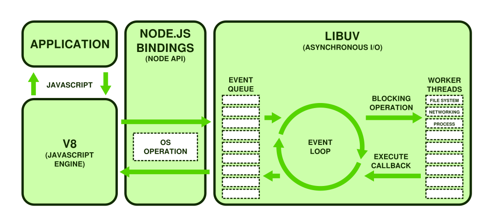

# Node.js - Aula 01 - Exercício
**user:** [delley](https://github.com/delley)
**autor:** Francisco Oliveira
**date:**

## 1. Explique como um processo síncrono e assíncrono roda no Node.js, dê um exemplo para cada.

Uma das principais caracteristicas no **Node.js** é executar processos de forma `assíncrona`. No **Node.js**, um processo `assíncrono` é baseado em eventos. A função é chamada junto com um parâmetro de `callback` (função de retorno), entra no ciclo do `event loop` e posteriormente é repassada ao `Thread Pool` para que o `event loop` continue o ciclo sem bloquear o sistema. Ao final do processamento, a função `callback` é chamada.

### Exemplo assíncrono

```js
var fs = require('fs');
var leituraAsync = function(arquivo){
  console.log("Fazendo leitura assíncrona");
  var inicio = new Date().getTime();
  fs.readFile(arquivo);
  var fim = new Date().getTime();
  console.log("Bloqueio assíncrono: " + (fim - inicio) + "ms");
};
module.exports = leituraAsync;
```

Já um processo `síncrono` no **Node.js**, bloqueia o sistema até que todo o processamento seja finalizado. Como pode ser visto no exemplo abaixo, as funções síncronas no **Node.js** possuem o sufixo `Sync`.

### Exemplo síncrono

```js
var fs = require('fs');
var leituraSync = function(arquivo){
  console.log("Fazendo leitura síncrona");
  var inicio = new Date().getTime();
  fs.readFileSync(arquivo);
  var fim = new Date().getTime();
  console.log("Bloqueio síncrono: " + (fim - inicio) + "ms");
};
module.exports = leituraSync;
```

## 2. Como o V8 executa JavaScript? Demonstre 1 exemplo com código ou imagem.

O V8 é a engine criada pela *Google* para ser usada em seu navegador *Chrome*. Em 2008 a *Google* abriu o código do V8, o que possibilitou que a comunidade entendesse a *engine* e compreendesse como o JavaScript é interpretado e compilado. Isso mesmo, o V8 é responsável por compilar o código JavaScript para linguagem de máquina, otimizar sua execução usando heurísticas, permitindo assim, que a execução seja feita em cima do código compilado e não do código interpretado.



De acordo com a figura acima, podemos resumir o fluxo de execução no seguinte: A partir de uma instrução enviada pela aplicação, o V8 compila e otimiza o código JavaScript. Em seguinda, a instrução é repassa para a API do **Node.js**, que se encarrega de entregá-la, por meio de instruções do SO, a LIBUV. Já na LIBUV, inicia-se o ciclo de execução, onde a instrução é colocada na na *Event Queue* e aguarda até que o *Event Loop* a retire e a entregue as *Works Threads* para a execução. Terminada a execução, as *Works Threads* entregam ao *Event Loop* a execução do *callback*, que é colocada na *Event Queue* e o ciclo de execução se repete. Finalizado o ciclo de execução da LIBUV, o resultado é devolvido a API do **Node.js**, que devolve ao V8 e finalmente para aplicação que enviou a instrução.   

## 3. Qual a diferença entre um sistema single para um multi-thread?

Em sistemas single-thread temos apenas uma thread atendendo todas as solicitações/requidições, como é o caso no **Node.js**. Já sistemas tradicionais multi-thread, cada solicitação/requisição é atendida por uma thread em paralelo, limitado ao tamanho do pool de threads.

## 4. Como a Thread Pool tem um tamanho padrão de 4, o que acontece se você enviar 5 requisições ao banco?

Qualquer requisição excedente é colocada em uma fila de espera. Apesar do tamanho padrão do thread pool ser 4, este pode ser definido em até 128.

## 5. Como você venderia o peixe do Node.js na sua empresa para tentar convencer seu chefe da sua adoção?

Acredito que a melhor maneira é mostrar *cases* de sucesso e *cases* internos comparando funções de sistemas legados com funções desenvolvidas em **Node.js**.

## 6. Qual a versão do seu `node`?

```
$ node -v
v6.10.3
```

## 7. Qual a versão do seu `npm`?

```
$ npm -v
3.10.10
```

## Referências

* [Node.js - Assíncrono Node.js](http://nodejsunijorge.blogspot.com.br/2012/11/arquitetura-do-nodejs.html)
